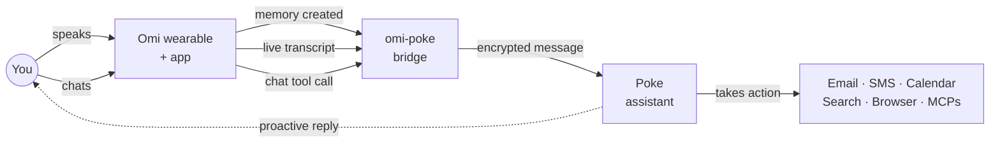
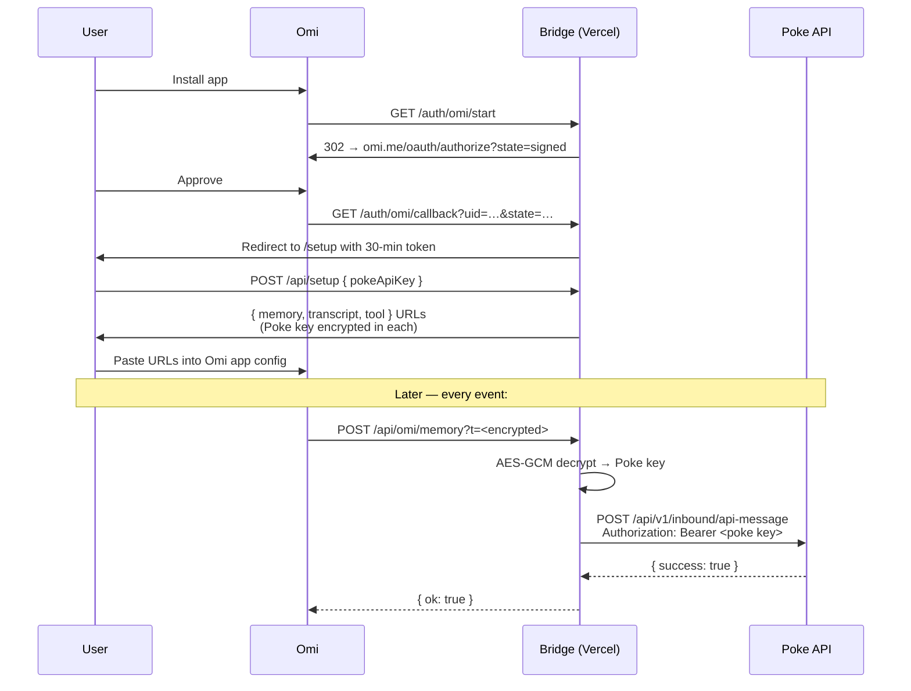
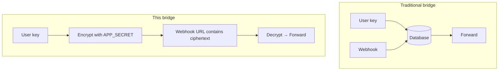

# omi-poke bridge

A **fully serverless, stateless** bridge that forwards [Omi](https://omi.me) events to your
[Poke](https://poke.com) assistant. Inspired by
[mdmohsin7/omiclaw-bridge](https://github.com/mdmohsin7/omiclaw-bridge), but
deployable on **Vercel** instead of running locally with ngrok.

- **No database.** Each user's Poke API key is encrypted (AES-256-GCM, key derived from `APP_SECRET`) into a per-user webhook URL. The server reads the URL, decrypts, forwards to Poke. Nothing is persisted.
- **Omi auth**: OAuth via `https://api.omi.me/v1/oauth/authorize` with HMAC-signed `state`.
- **Poke auth**: each user pastes their own Poke API key once during setup.
- **Multi-tenant**: install it as a public Omi app — every user gets their own encrypted URLs.
- **Open source**: MIT.

## What it can do

The bridge gives your Poke assistant ears (via Omi's wearable + transcription) and your Omi assistant a brain that can act in the real world (via Poke's automations, integrations, and proactive messaging).




**Each event type is opt-in.** During setup you toggle checkboxes for the events you want forwarded — disabled events get no URL issued, so Omi physically cannot send them. Default is **chat tool only** (most explicit, least traffic). Re-run setup any time to change the toggles.

**Three event types flow Omi → Poke, plus an optional MCP server:**


| Toggle     | Channel                  | What triggers it                                                                                              | What Poke receives               | Example                                                                                                |
| ---------- | ------------------------ | ------------------------------------------------------------------------------------------------------------- | -------------------------------- | ------------------------------------------------------------------------------------------------------ |
| default ON | **Omi chat tool**        | You explicitly invoke `send_to_poke` in the Omi app                                                           | A single message you wrote/spoke | "Send to Poke: book a flight to Tokyo next Tuesday under $800" — Poke runs the booking workflow.       |
| optional   | **Omi memory created**   | Omi finishes a conversation and saves a memory                                                                | Title + summary + transcript     | After a meeting, Poke gets the summary and emails action items to attendees.                           |
| optional   | **Omi real-time transcript** | Live audio while you're talking                                                                           | Rolling transcript snippets      | You say "remind me to call mom tonight" — Poke schedules an SMS reminder before the conversation ends. |
| optional   | **MCP server**           | Any MCP client (Poke, Claude Desktop, Cursor, …) calls the `send_to_poke` tool exposed at `/api/mcp/<token>`  | Whatever the MCP client sends    | Add the URL to Poke's integrations to let one Poke account call another, or to your IDE for chat-driven Poke calls. |


**Concrete use cases:**

- *Voice → action.* Talk to your Omi wearable, have Poke schedule, email, search, or run any of its connected automations.
- *Meeting capture.* Every saved memory is auto-summarized into Poke, where it can route to a CRM, a Notion page, or an email digest.
- *Hands-free reminders.* Mention something in passing during a call; Poke picks it up from the transcript and acts.
- *Cross-tool glue.* Poke already integrates with email, calendar, browser, MCP servers, etc. — Omi becomes another input source for all of them.
- *Proactive follow-ups.* Poke can message you back via its own channels (SMS, email) about something it heard through Omi.

### Per-user data flow




### Why stateless




- No DB to provision, back up, or breach.
- Cold start ≈ 0 ms of I/O before forwarding.
- Revocation = rotate the user's Poke key (per-user) or rotate `APP_SECRET` (global wipe).

## How it works

```
Omi user installs app
   │
   ▼
GET /auth/omi/start          → 302 to Omi OAuth (signed state)
   │
   ▼
Omi authorize → /auth/omi/callback?uid=…&state=…
   │
   ▼
Verify state, mint a 30-min setup token, redirect to /setup
   │
   ▼
User pastes Poke API key → POST /api/setup
   │
   ▼
Server encrypts {pokeKey, uid} into a token and returns three webhook URLs
   │
   ▼
User pastes URLs into the Omi app config
   │
   ▼
Omi events POST to /api/omi/*?t=<encrypted-token>
   │
   ▼
Bridge decrypts → POST https://poke.com/api/v1/inbound/api-message
```

No DB, no Redis, no KV. Cold starts are fast and cost is effectively zero.

## Endpoints


| Method | Path                      | Purpose                                  |
| ------ | ------------------------- | ---------------------------------------- |
| GET    | `/`                       | Landing page                             |
| GET    | `/auth/omi/start`         | Begin Omi OAuth                          |
| GET    | `/auth/omi/callback`      | OAuth callback (`uid`, `state`)          |
| GET    | `/setup`                  | Form to enter Poke API key               |
| POST   | `/api/setup`              | Returns the three encrypted webhook URLs |
| POST   | `/api/omi/memory?t=…`     | "Memory created" webhook → Poke          |
| POST   | `/api/omi/transcript?t=…` | Real-time transcript webhook → Poke      |
| POST   | `/api/omi/tool?t=…`       | Chat tool / action → Poke                |
| POST   | `/api/mcp/<token>`        | MCP (JSON-RPC) server, exposes `send_to_poke` tool |
| GET    | `/api/health`             | Health check                             |


## MCP server

If you toggle **MCP server** on the setup page, you'll get a URL like:

```
https://your-project.vercel.app/api/mcp/<encrypted-token>
```

It's a minimal MCP "streamable HTTP" server (JSON-RPC 2.0) that exposes one tool:

| Tool           | Args                | Effect                                                                |
| -------------- | ------------------- | --------------------------------------------------------------------- |
| `send_to_poke` | `{ message: string }` | Forwards `message` to your Poke assistant via the Poke v1 API.        |

**Add it to Poke** — `poke.com/settings/connections/integrations/new` → MCP server → paste the URL.

**Add it to Claude Desktop / Cursor / any MCP client** — register it as a remote MCP server at the URL above. The token in the path encrypts your Poke key, so each client URL is per-user.

The server implements `initialize`, `tools/list`, `tools/call`, and `ping`. Notifications (e.g. `notifications/initialized`) are accepted and silently acknowledged.

## Deploy on Vercel

### 1. Generate `APP_SECRET`

```bash
openssl rand -hex 32
```

### 2. Deploy

```bash
git clone https://github.com/YOUR-USER/omi-poke-bridge
cd omi-poke-bridge
npx vercel --prod
```

Or click "Import Project" in the Vercel dashboard and point it at your fork.

### 3. Set environment variables in Vercel


| Variable             | Required | Description                                                   |
| -------------------- | -------- | ------------------------------------------------------------- |
| `OMI_APP_ID`         | yes      | From the Omi developer dashboard                              |
| `APP_SECRET`         | yes      | Long random string. Signs OAuth state and derives the AES key |
| `PUBLIC_BASE_URL`    | yes      | e.g. `https://your-project.vercel.app`                        |
| `OMI_WEBHOOK_SECRET` | no       | If set, Omi webhooks must send `Authorization: Bearer <this>` |


Redeploy after setting them.

## What to set up on Omi

In the [Omi developer dashboard](https://h.omi.me) create a new app:

1. **App ID** → copy into `OMI_APP_ID`.
2. **App Home URL / OAuth redirect** → `https://your-project.vercel.app/auth/omi/callback` (Omi will redirect here with `?uid=…&state=…` after the user authorizes).
3. **Install / auth link** (the URL users click to install) → `https://your-project.vercel.app/auth/omi/start`.
4. *(Optional)* If Omi lets you set a webhook bearer token, set the same value as `OMI_WEBHOOK_SECRET`.
5. After installing the app yourself, you'll be redirected to `/setup`. Paste your Poke key, then copy the **three URLs** the page gives you back into your Omi app's webhook configuration:
  - **Memory Created** webhook → the `memory` URL
  - **Real-time Transcript** webhook *(optional, noisier)* → the `transcript` URL
  - **Chat Tool / Action** → the `tool` URL (give it a name like `send_to_poke` and a description like *"Send a message to my Poke assistant."*)
6. Submit the app for review so it shows up in the Omi app store, or share the install link directly.

> Each user who installs the app goes through the same OAuth → `/setup` flow and receives **their own** encrypted webhook URLs to paste into their personal Omi app config. There's no shared state between users.

## What to set up on Poke

Each user does this once after installing the Omi app:

1. Go to [https://poke.com/settings/advanced](https://poke.com/settings/advanced) and create a new API key.
2. Copy the key.
3. After installing the Omi app you're redirected to the bridge's `/setup` page — paste the key there and click **Generate webhook URLs**.
4. Copy the three URLs the page returns and paste each into the matching webhook field in your Omi app config.

Per the [Poke API docs](https://poke.com/docs/api), the bridge calls
`POST https://poke.com/api/v1/inbound/api-message` with
`Authorization: Bearer <your-key>` and a JSON body containing a `message` field.

## Local development

```bash
cp .env.example .env.local
# fill in OMI_APP_ID, APP_SECRET, PUBLIC_BASE_URL=http://localhost:3000
npm install
npm run dev
```

To test the OAuth round-trip locally you need a public URL — use a tunnel
(ngrok / cloudflared) and update `PUBLIC_BASE_URL` and the Omi app's redirect
URL accordingly.

## Security notes

- **No persistence** means no database to compromise. The trade-off: anyone who learns a webhook URL can send messages to that user's Poke assistant.
- The webhook URL contains the user's Poke API key encrypted with AES-256-GCM under a key derived from `APP_SECRET`. It cannot be decrypted without server access to `APP_SECRET`.
- **Revocation:**
  - Per-user → rotate that user's Poke API key in Poke. The encrypted URL still decrypts, but Poke will reject the stale key.
  - Global → rotate `APP_SECRET`. Every issued webhook URL becomes invalid; every user must reinstall and re-paste their key.
- `OMI_WEBHOOK_SECRET` is recommended in production to prevent random callers who guess or scrape webhook URLs from triggering Poke messages.
- This service does not log message bodies. Don't add logging that persists transcripts.

## License

MIT — see [LICENSE](./LICENSE).